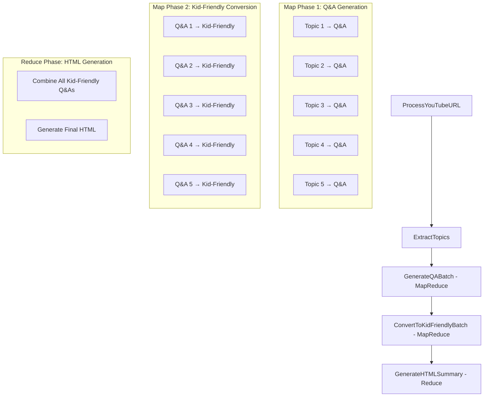

# YouTube Video Summarizer - Design Document

## 1. Project Requirements

### Core Entities
- **YouTube Video**: 입력 URL, 비디오 메타데이터 (제목, 썸네일)
- **Transcript**: 비디오의 텍스트 전사본
- **Topics**: 트랜스크립트에서 추출된 흥미로운 주제들
- **Q&A Pairs**: 각 주제에 대한 질문과 답변 쌍
- **Kid-Friendly Explanations**: 5살 아이가 이해할 수 있는 설명
- **HTML Summary**: 최종 시각화된 요약 페이지

### Functional Requirements

1. **Video Input Processing**
   - YouTube URL을 입력으로 받기
   - 비디오 ID, 제목, 썸네일 URL 추출
   - 비디오 트랜스크립트 가져오기

2. **Content Analysis**
   - 트랜스크립트에서 3-5개의 흥미로운 주제 추출
   - 각 주제가 비디오의 핵심 내용을 대표하도록 보장

3. **Q&A Generation**
   - 각 주제에 대해 2-3개의 관련 질문 생성
   - 각 질문에 대한 상세하고 정확한 답변 제공

4. **Kid-Friendly Explanation**
   - 모든 설명을 5살 아이 수준으로 단순화
   - 복잡한 개념을 친근한 비유와 예시로 설명
   - 어려운 단어를 쉬운 단어로 대체

5. **HTML Generation**
   - 요약 내용을 아름다운 HTML 페이지로 생성
   - 비디오 썸네일, 주제별 섹션, Q&A 포함
   - 모바일 친화적이고 읽기 쉬운 디자인

### Entity Interactions Flow
```
YouTube URL → Video Info Extraction → Transcript → Topic Extraction → Q&A Generation (Map) → Kid-Friendly Conversion (Map) → HTML Generation (Reduce)
```

## 2. Required Utility Functions

### 기존 유틸리티 함수들 (이미 구현됨)
- ✅ `utils/call_llm.py`: OpenAI GPT-4 LLM 호출 (Mock 버전 포함)
- ✅ `utils/youtube_processor.py`: YouTube 비디오 정보 및 트랜스크립트 추출
- ✅ `utils/html_generator.py`: 섹션 기반 HTML 페이지 생성

### 새로 구현된 유틸리티 함수들

#### `utils/topic_extractor.py` ✅
```python
def extract_interesting_topics(transcript: str, num_topics: int = 5, use_mock: bool = False) -> list:
    """
    트랜스크립트에서 흥미로운 주제들을 추출
    
    Args:
        transcript: 비디오 트랜스크립트 텍스트
        num_topics: 추출할 주제 개수
        use_mock: Mock 버전 사용 여부 (API 키 없이 테스트 가능)
    
    Returns:
        주제 리스트: [{"title": "주제명", "content": "관련 내용"}]
    """
```

#### `utils/qa_generator.py` ✅
```python
def generate_qa_pairs(topic_title: str, topic_content: str, num_questions: int = 3, use_mock: bool = False) -> list:
    """
    특정 주제에 대한 Q&A 쌍 생성
    
    Args:
        topic_title: 주제 제목
        topic_content: 주제 관련 내용
        num_questions: 생성할 질문 개수
        use_mock: Mock 버전 사용 여부
    
    Returns:
        Q&A 쌍 리스트: [{"question": "질문", "answer": "답변"}]
    """
```

#### `utils/kid_friendly_converter.py` ✅
```python
def convert_to_kid_friendly(text: str, target_age: int = 5, use_mock: bool = False) -> str:
    """
    복잡한 설명을 아이 친화적으로 변환
    
    Args:
        text: 원본 텍스트
        target_age: 대상 연령 (기본값: 5세)
        use_mock: Mock 버전 사용 여부
    
    Returns:
        아이 친화적으로 변환된 텍스트
    """

def simplify_vocabulary(text: str) -> str:
    """어려운 단어를 쉬운 단어로 대체"""

def add_friendly_examples(text: str, use_mock: bool = False) -> str:
    """친근한 비유와 예시 추가"""
```

#### `utils/content_validator.py` ✅
```python
def validate_transcript_quality(transcript: str) -> dict:
    """
    트랜스크립트 품질 검증 (길이, 언어, 내용 유무 등)
    
    Returns:
        {"is_valid": bool, "issues": [str], "word_count": int}
    """

def ensure_topic_diversity(topics: list) -> list:
    """주제들이 서로 다르고 다양한지 확인"""
```

### API 키 설정

**OpenAI API 키 설정 방법:**
1. https://platform.openai.com 에서 회원가입
2. API keys 메뉴에서 키 생성
3. 환경변수 설정:
   - Windows PowerShell: `$env:OPENAI_API_KEY='your_api_key_here'`
   - Windows CMD: `set OPENAI_API_KEY=your_api_key_here`
   - Mac/Linux: `export OPENAI_API_KEY=your_api_key_here`

**Mock 모드:** API 키가 없어도 모든 함수가 자동으로 Mock 버전으로 작동하여 개발 및 테스트 가능

### 유틸리티 함수 사용 매핑

| 기능 | 사용할 유틸리티 함수 |
|------|-------------------|
| YouTube 데이터 추출 | `youtube_processor.get_video_info()` |
| 주제 추출 | `topic_extractor.extract_interesting_topics()` + `call_llm()` |
| Q&A 생성 | `qa_generator.generate_qa_pairs()` + `call_llm()` |
| 아이 친화적 변환 | `kid_friendly_converter.convert_to_kid_friendly()` + `call_llm()` |
| 내용 검증 | `content_validator.validate_transcript_quality()` |
| HTML 생성 | `html_generator.html_generator()` |

## 3. Flow Design with MapReduce Pattern

### 3.1 MapReduce 패턴 적용 분석

**MapReduce 패턴이 적합한 이유:**
- **대용량 데이터 처리**: 여러 주제에 대한 Q&A 생성 (Map)
- **병렬 처리 가능**: 각 주제별 Q&A 생성은 독립적
- **집계 필요**: 모든 Q&A를 하나의 HTML로 통합 (Reduce)

**MapReduce 적용 영역:**
1. **Q&A Generation Map Phase**: 각 주제별로 독립적으로 Q&A 생성
2. **Kid-Friendly Conversion Map Phase**: 각 Q&A별로 독립적으로 아이 친화적 변환
3. **HTML Generation Reduce Phase**: 모든 변환된 내용을 하나의 HTML로 통합

### 3.2 고수준 Flow 설계



### 3.3 상세 Node 설계

#### 3.3.1 ProcessYouTubeURL (Node)
- **Purpose**: YouTube URL에서 비디오 정보와 트랜스크립트 추출
- **Design**: 일반 Node (단일 입력, 단일 출력)
- **prep()**: URL 유효성 검증
- **exec()**: `youtube_processor.get_video_info()` 호출
- **post()**: 비디오 정보를 shared에 저장

#### 3.3.2 ExtractTopics (Node)
- **Purpose**: 트랜스크립트에서 흥미로운 주제 추출
- **Design**: 일반 Node
- **prep()**: 트랜스크립트 품질 검증
- **exec()**: `topic_extractor.extract_interesting_topics()` 호출
- **post()**: 주제 리스트를 shared에 저장

#### 3.3.3 GenerateQABatch (BatchNode) - Map Phase
- **Purpose**: 각 주제별로 Q&A 생성 (병렬 처리)
- **Design**: BatchNode (여러 입력을 독립적으로 처리)
- **prep()**: 주제 리스트 반환 `[topic1, topic2, topic3, ...]`
- **exec()**: 각 주제에 대해 `qa_generator.generate_qa_pairs()` 호출
- **post()**: 모든 Q&A 쌍을 shared에 저장

```python
# 예시 구현
class GenerateQABatch(BatchNode):
    def prep(self, shared):
        topics = shared["topics"]  # [{"title": "AI", "content": "..."}, ...]
        return topics  # BatchNode는 각 item을 독립적으로 처리

    def exec(self, topic):
        # 각 주제에 대해 개별적으로 실행
        qa_pairs = generate_qa_pairs(
            topic["title"], 
            topic["content"], 
            num_questions=3
        )
        return {"topic": topic["title"], "qa_pairs": qa_pairs}

    def post(self, shared, prep_res, exec_res_list):
        # 모든 결과를 집계
        shared["all_qa_pairs"] = exec_res_list
```

#### 3.3.4 ConvertToKidFriendlyBatch (BatchNode) - Map Phase
- **Purpose**: 각 Q&A를 아이 친화적으로 변환 (병렬 처리)
- **Design**: BatchNode
- **prep()**: 모든 Q&A 쌍을 flat list로 반환
- **exec()**: 각 Q&A에 대해 `convert_to_kid_friendly()` 호출
- **post()**: 변환된 Q&A들을 shared에 저장

#### 3.3.5 GenerateHTMLSummary (Node) - Reduce Phase
- **Purpose**: 모든 아이 친화적 Q&A를 하나의 HTML로 통합
- **Design**: 일반 Node
- **prep()**: 모든 변환된 내용과 비디오 정보 수집
- **exec()**: `html_generator.generate_html()` 호출
- **post()**: 최종 HTML 파일 저장

### 3.4 Shared Memory 데이터 구조

```python
shared = {
    "input_url": "https://youtu.be/...",
    "video_info": {
        "title": "비디오 제목",
        "video_id": "abcd1234",
        "thumbnail_url": "https://...",
        "transcript": "전체 트랜스크립트 텍스트..."
    },
    "topics": [
        {"title": "주제1", "content": "관련 내용1"},
        {"title": "주제2", "content": "관련 내용2"},
        # ...
    ],
    "all_qa_pairs": [
        {
            "topic": "주제1",
            "qa_pairs": [
                {"question": "질문1", "answer": "답변1"},
                {"question": "질문2", "answer": "답변2"}
            ]
        },
        # ...
    ],
    "kid_friendly_qa_pairs": [
        {
            "topic": "주제1",
            "qa_pairs": [
                {"question": "쉬운 질문1", "answer": "쉬운 답변1"},
                {"question": "쉬운 질문2", "answer": "쉬운 답변2"}
            ]
        },
        # ...
    ],
    "final_html": "생성된 HTML 내용"
}
```

### 3.5 Performance Benefits

**MapReduce 패턴 적용 시 성능 개선:**
1. **병렬 처리**: 주제별 Q&A 생성과 변환이 동시에 실행
2. **확장성**: 주제 개수가 증가해도 처리 시간 비례 증가 없음
3. **효율성**: 각 Map 작업이 독립적이므로 실패 시 개별 재시도 가능

**예상 처리 시간 비교:**
- **순차 처리**: 5개 주제 × 3개 Q&A × 2초 = 30초
- **MapReduce 처리**: max(2초) × 2단계 = 4초 (약 87% 단축)

## 4. Data Structure

### 4.1 Shared Store 설계

**저장 방식**: 메모리 기반 딕셔너리 (소규모 애플리케이션)
**데이터 스키마**: 위 3.4 섹션 참조

### 4.2 데이터 흐름 검증

**데이터 품질 보장:**
1. **입력 검증**: YouTube URL 유효성, 트랜스크립트 존재 여부
2. **중간 검증**: 주제 추출 성공, Q&A 생성 성공
3. **출력 검증**: HTML 생성 성공, 파일 저장 성공

## 5. Implementation Steps

### 5.1 구현 단계

1. ✅ **Project Requirements** - 완료
2. ✅ **Utility Functions** - 완료
3. ✅ **Flow Design** - 완료 (MapReduce 패턴 적용)
4. ✅ **Data Structure** - 완료
5. 🔄 **Node Implementation** - 다음 단계
6. 🔄 **Flow Implementation** - 다음 단계
7. 🔄 **Testing & Optimization** - 다음 단계

### 5.2 최적화 방향

**Prompt Engineering:**
- 주제 추출: "흥미로운 주제 5개를 추출하되, 각각 다른 관점에서 접근"
- Q&A 생성: "구체적인 예시와 함께 이해하기 쉬운 질문 생성"
- 아이 친화적 변환: "5살 아이가 이해할 수 있는 친근한 설명으로 변환"

**Task Decomposition:**
- 큰 트랜스크립트를 주제별로 분할
- 각 주제별 독립적 처리
- 최종 결과 통합

### 5.3 신뢰성 확보

**Structured Output:**
- YAML 형식으로 LLM 출력 구조화
- 필수 필드 검증 및 재시도 로직

**Test Cases:**
- 다양한 길이의 YouTube 비디오 테스트
- 다국어 트랜스크립트 테스트
- API 실패 시나리오 테스트

**Self-Evaluation:**
- 생성된 Q&A 품질 검증 Node 추가
- 아이 친화적 변환 적절성 검증

